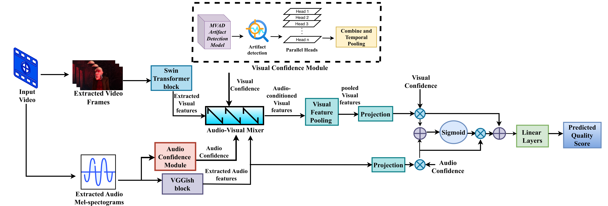

# MCM-AVQA: Multimodal Confidence Modeling in Audio-Visual Quality Assessment

> Official implementation of **"Multimodal Confidence Modeling in Audio-Visual Quality Assessment"**
> Mayesha Maliha R. Mithila, Mylene C.Q. Farias — Texas State University

MCM-AVQA is a confidence-aware framework for **No-Reference Audio-Visual Quality Assessment (AVQA)**. Unlike most AVQA models that treat audio and video as equally reliable, MCM-AVQA explicitly estimates **modality-specific confidence** and injects it into a dedicated **Audio-Visual Mixer (AVM)** that performs frame-level, confidence-guided channel attention. This allows high-confidence streams to dominate fusion while unreliable inputs are suppressed — which is critical under **asymmetric distortions**, where one modality (e.g., the audio) is heavily degraded while the other remains clean.

---

## Highlights

- **Confidence-aware Audio-Visual Mixer (AVM)** — gates cross-modal fusion at the *feature level* via channel attention, conditioned on per-modality confidence.
- **Visual Confidence Module (VCM)** — uses a frozen pretrained MVAD artifact detector (10 artifact classes) + temporal 1D conv + multi-head MLP combiner to produce a clip-level visual confidence score.
- **Audio Confidence Module (ACM)** — derives confidence from no-reference SCOREQ speech-quality predictions, normalized to [0, 1].
- **Robust under asymmetric distortions** — stronger Exp3→Exp1 / Exp3→Exp2 generalization than late-fusion and attention-only baselines.

---

## Architecture

<p align="center">
  
</p>

<p align="center"><em><b>Figure 1.</b> Overall architecture of MCM-AVQA. Swin and VGGish encode the video and audio streams, while specific modules estimate visual and audio confidences. The confidence-aware Audio-Visual Mixer then modulates cross-modal attention before predicting the overall audio-visual quality.</em></p>

The model has four main components:

1. **Visual encoder** — Swin-Small Transformer extracts spatiotemporal features from 8 uniformly sampled frames per clip.
2. **Audio encoder** — VGGish encodes log-mel spectrograms into a clip-level embedding.
3. **Confidence estimators** — VCM (from MVAD artifact probabilities) and ACM (from SCOREQ scores) produce scalars `r_v, r_a ∈ [0, 1]`.
4. **Audio-Visual Mixer + Fusion + Regressor** — confidence-gated cross-modal attention, followed by a lightweight global fusion network and a regression head producing the final quality score.

Training loss combines MSE with a Pearson-correlation loss:

```
L = L_MSE + λ · (1 − ρ(ŷ, y)),  λ = 0.15
```
---

## Results

### Comparison with state-of-the-art AVQA methods

All scores are mapped to MOS via 4-parameter logistic regression. Best result per column in **bold**.

| Method            | UnB-AV PLCC | UnB-AV SROCC | LIVE-SJTU PLCC | LIVE-SJTU SROCC | UnB-AVQ PLCC | UnB-AVQ SROCC |
|-------------------|:-----------:|:------------:|:--------------:|:---------------:|:------------:|:-------------:|
| Linear            | 0.441       | 0.337        | 0.648          | 0.645           | 0.881        | 0.869         |
| Minkowski         | 0.342       | 0.314        | 0.653          | 0.653           | 0.768        | 0.879         |
| Power             | 0.662       | 0.608        | 0.628          | 0.640           | 0.887        | 0.862         |
| NAViDAd           | 0.881       | 0.890        | —              | —               | —            | —             |
| DNN-RNT           | —           | —            | 0.960          | 0.961           | 0.904        | 0.902         |
| DNN-SND           | —           | —            | 0.955          | 0.951           | 0.856        | 0.848         |
| DNFAVQ            | —           | —            | 0.918          | 0.907           | —            | —             |
| Nave+w2v          | **0.936**   | **0.959**    | —              | —               | —            | —             |
| UNQA (A/V)        | —           | —            | —              | —               | 0.903        | 0.863         |
| **MCM-AVQA (ours)** | 0.894     | 0.876        | **0.965**      | **0.970**       | **0.967**    | **0.952**     |

On UnB-AV, Nave+w2v achieves higher correlation but MCM-AVQA produces a **0.054 lower mean absolute error**, statistically significant under both the paired t-test (p = 2.1×10⁻³) and the Wilcoxon test (p = 4.4×10⁻³).

### Ablation (UnB-AVQ / LIVE-SJTU)

| AVM | VCM | ACM | UnB-AVQ PLCC | UnB-AVQ SROCC | LIVE-SJTU PLCC | LIVE-SJTU SROCC |
|:---:|:---:|:---:|:------------:|:-------------:|:--------------:|:---------------:|
|  −  |  −  |  −  | 0.907        | 0.894         | 0.916          | 0.896           |
|  +  |  −  |  −  | 0.920        | 0.892         | 0.923          | 0.902           |
|  +  |  +  |  −  | 0.927        | 0.898         | 0.931          | 0.934           |
|  +  |  −  |  +  | 0.943        | 0.932         | 0.948          | 0.943           |
|  +  |  +  |  +  | **0.967**    | **0.952**     | **0.965**      | **0.970**       |

All three components contribute, and the AVM alone (without confidence inputs) already yields a measurable gain over the late-fusion baseline.

---

## Installation

```bash
git clone https://github.com/mithila442/MCM-AVQA.git
cd MCM-AVQA

# Python ≥ 3.9, CUDA-enabled GPU recommended
python -m venv venv
source venv/bin/activate
pip install -r requirements.txt
```

---

## Pretrained Weights

The two pretrained checkpoints required to run MCM-AVQA are hosted on Google Drive (they are too large to ship in this repository). Download both files and place them under `checkpoints/`.

| File | Description | Download |
|------|-------------|:---:|
| `swin_small_patch4_window7_224.pth` | Swin-Small ImageNet-pretrained backbone (visual encoder) | [Google Drive](https://drive.google.com/file/d/1VoCRSA1q8lIiqxZcgqNuoaCtPa7Hro9k/view?usp=sharing) |
| `visual_artifacts_ckpt.ckpt`        | MVAD artifact detector (frozen) used by the Visual Confidence Module | [Google Drive](https://drive.google.com/file/d/1VsklW4dQlM9IRlpTSJFjsuscT2cBdsXP/view?usp=sharing) |

After downloading, your `checkpoints/` folder should look like:

```
checkpoints/
├── swin_small_patch4_window7_224.pth
└── visual_artifacts_ckpt.ckpt
```

Paths are configured in `configs/model_config.yaml` (`swin.checkpoint_path` and `visual_reliability.checkpoint_path`). Update them there if you place the files elsewhere.

## Datasets

MCM-AVQA is evaluated on three public AVQA datasets. Download each from its source and place under `datasets/`.

| Dataset       | Content                                | Link |
|---------------|----------------------------------------|------|
| **LIVE-SJTU** | 336 distorted clips, MOS ∈ [0, 100]    | [Official page](https://live.ece.utexas.edu/research/Quality/LIVE_SJTU_AVQA.html) |
| **UnB-AV**    | 800 clips, Exp1/Exp2/Exp3 distortions   | [Official page](https://www.ene.unb.br/mylene/databases.html) |
| **UnB-AVQ**   | 78 clips                                | [Official page](https://www.ene.unb.br/mylene/databases.html) |

Expected layout:

```
datasets/
├── LIVE-SJTU_AVQA/
│   ├── Distorted/         # *.yuv + *.wav files
│   └── MOS.xlsx
├── exp3/                   # UnB-AV Exp3 (.avi)
│   └── UnB-AVQ-2018-Experiment3.csv
└── 2013-UnB-AVQ/
    └── Exp3/               # UnB-AVQ 2013 Exp3 (.avi)
        └── UnB-AVQ-2013-Experiment3.csv
```

### Audio confidence CSVs (SCOREQ)

The audio confidence module needs precomputed SCOREQ-based reliability values per clip. Generate them with:

```bash
python scoreq_nr_sjtu.py    # produces scoreq_reliability_sjtu.csv
```

The CSV format expected by the dataset loaders is `filename,scoreq_reliability` (one row per clip, reliability in [0, 1]). Equivalent CSVs for UnB-AV / UnB-AVQ should be named `scoreq_reliability_unb13.csv` and `scoreq_audio_reliability.csv` respectively.

---

## Training

The training entry point is `scripts/train_audiovisual.py`. Pick the dataset with `--dataset {live-sjtu, unb2013, unb2018}`. For example, for LIVE-SJTU:

### LIVE-SJTU

```bash
python3 scripts/train_audiovisual.py \
    --dataset live-sjtu \
    --config configs/model_config.yaml \
    --video_dir datasets/LIVE-SJTU_AVQA/Distorted \
    --mos_csv datasets/LIVE-SJTU_AVQA/MOS.xlsx \
    --reliability_csv scoreq_reliability_sjtu.csv
```

### Default hyperparameters

| Setting          | Value         |
|------------------|---------------|
| Optimizer        | Adam          |
| Learning rate    | 5 × 10⁻⁵      |
| Weight decay     | 5 × 10⁻³      |
| Batch size       | 6             |
| Frames per clip  | 8 (uniform)   |
| Audio backbone   | VGGish        |
| Visual backbone  | Swin-Small    |
| Loss             | MSE + 0.15 · (1 − PLCC) |
| Early stopping   | patience = 20 |
| Train/Val/Test split | 70 / 15 / 15 |
| GPU              | NVIDIA RTX 5000 (each 25GB) |


Train/val/test indices are saved as `.npy` files in the working directory at the start of training so they can be reused for evaluation.

---

## Evaluation

Each dataset has its own evaluation script. Pass the trained checkpoint and the test split file produced during training. For example, for LIVE-SJTU:

### LIVE-SJTU

```bash
python scripts/evaluate_livesjtu.py \
    --config configs/model_config.yaml \
    --video_dir datasets/LIVE-SJTU_AVQA/Distorted \
    --mos_csv datasets/LIVE-SJTU_AVQA/MOS.xlsx \
    --reliability_csv scoreq_reliability_sjtu.csv \
    --checkpoint checkpoints/enhanced_checkpoint_best_epoch_413.pth \
    --batch_size 2 \
    --test_indices test_indices.npy
```

Each evaluation script reports SROCC, PLCC (before and after 4PL mapping), RMSE and MAE, and writes a CSV of per-clip predictions plus scatter plots (`scatter_*_pred_vs_mos_{before,after}4pl.png`).

---

## Citation

If you use this code or build on this work, please cite:

```bibtex
@misc{mithila2026mcmavqa,
      title={Multimodal Confidence Modeling in Audio-Visual Quality Assessment}, 
      author={Mayesha Maliha R. Mithila and Mylene C. Q. Farias},
      year={2026},
      eprint={2605.01219},
      archivePrefix={arXiv},
      primaryClass={cs.MM},
      url={https://arxiv.org/abs/2605.01219}, 
}
```

---

## Acknowledgements

This work builds on several open-source components:

- **Swin Transformer** — Liu et al., ICCV 2021
- **VGGish** — Hershey et al., ICASSP 2017
- **MVAD** — Feng et al., WACV 2025 — used as a frozen visual artifact detector
- **SCOREQ** — Ragano et al., NeurIPS 2024 — used for no-reference audio confidence

We thank the authors of LIVE-SJTU, UnB-AV, and UnB-AVQ for releasing their datasets to the research community.

---

## License

Released for academic and research use. See `LICENSE` for details.
